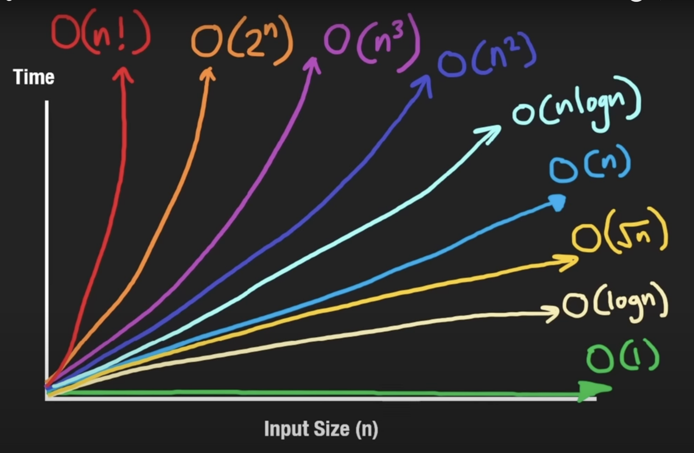

# Day 1: January 23, 2024

# Space & Time Complexity

## Big $O$ Notation

- Constants dont matter ( n/5, n+5, n; all are equivalent)

### $O(1)$

```c++
//  Array
nums = [1, 2, 3]
nums.append(4)    # push to end
nums.pop()        # pop from end
nums[0]           # lookup

// HashMap / Set
hashMap = {}
hashMap["key"] = 10     # insert
print("key" in hashMap) # lookup
print(hashMap["key"])   # lookup
hashMap.pop("key")      # remove
```

### $O(n)$
```c++
nums = [1, 2, 3]
sum(nums)           # sum of array
for n in nums:      # looping
    print(n)

nums.insert(1, 100) # insert middle
nums.remove(100)    # remove middle
print(100 in nums)  # search

import heapq
heapq.heapify(nums) # build heap

//  sometimes even nested loops can be O(n)
//  (e.g. monotonic stack or sliding window)
```

### $O(n^2)$
```c++
// Traverse a square grid
nums = [[1, 2, 3], [4, 5, 6], [7, 8, 9]]
for i in range(len(nums)):
    for j in range(len(nums[i])): 
        print(nums[i][j])


// Get every pair of elements in array
nums = [1, 2, 3]
for i in range(len(nums)):
    for j in range(i + 1, len(nums)):
        print(nums[i], nums[j])

# Insertion sort (insert in middle n times -> n^2)
```

### $O(log n)$
- Much more efficient than $O(n), like a lot$
```c++
// Binary search
// In each iteration, the size of the array becomes 
// half of what was previously,
// hence no of iterations become log n base 2
nums = [1, 2, 3, 4, 5]
target = 6
l, r = 0, len(nums) - 1
while l <= r:
    m = (l + r) // 2
    if target < nums[m]:
        r = m - 1
    elif target > nums[m]:
        l = m + 1
    else:
        print(m)
        break

// Binary Search on BST
def search(root, target):
    if not root:
        return False
    if target < root.val:
        return search(root.left, target)
    elif target > root.val:
        return search(root.right, target)
    else: 
        return True
        
//Heap Push and Pop
import heapq
minHeap = []
heapq.heappush(minHeap, 5)
heapq.heappop(minHeap)
```

### $O(n logn)$
```c++
// HeapSort
import heapq
nums = [1, 2, 3, 4, 5]
heapq.heapify(nums)     // O(n)
while nums:
    heapq.heappop(nums) // O(logn)

// MergeSort (and most built-in sorting functions)
```

{width=500px}


